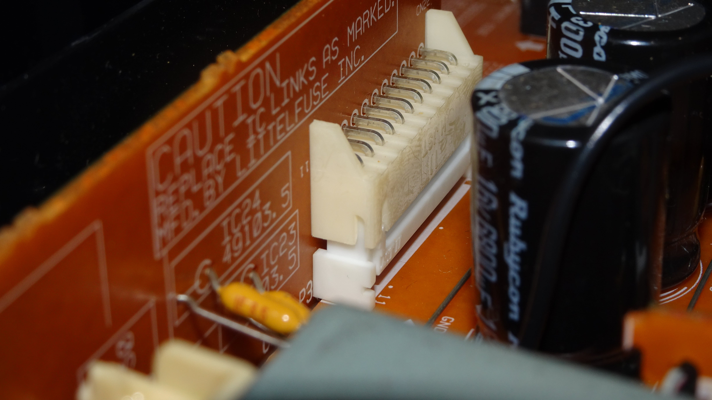
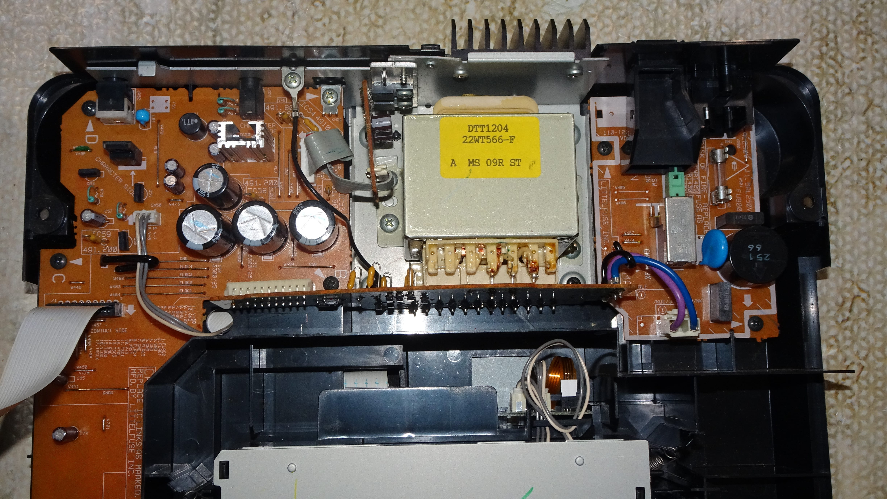
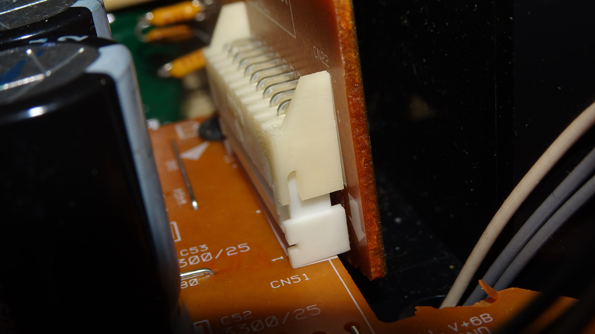
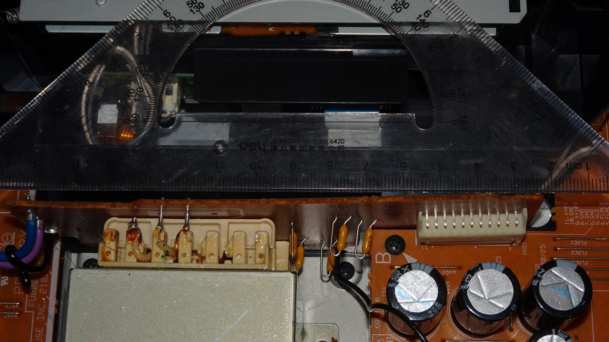
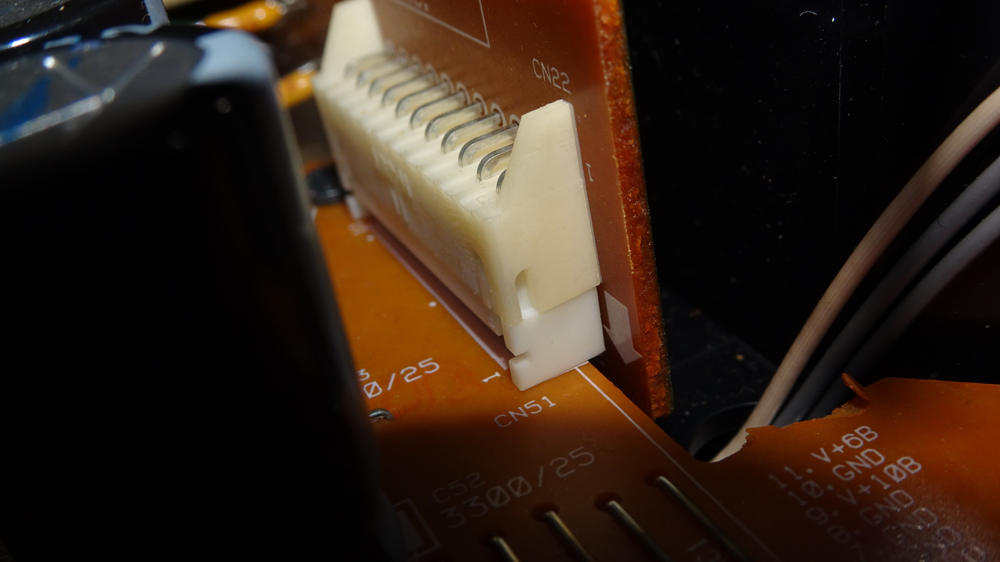
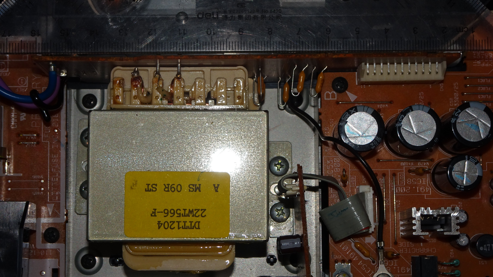

# Pioneer CDJ800 MK2 Transformer Powerboard Connector Issue

TL;DR: CDJ800 MK2 has a manufacturing fault which led to the CDJ not getting proper power.

## Symptoms of this issue

The CDJ might have these issues:

- Does not power on
- Powered on, CD drive and buttons are working but no/only one display work.

## The cause of this issue

The issue is likely caused by a disconnected connector between the transfomer powerboard and the service PCB.

I believe this is a wide spared manufacturing fault of both an over tightening screws and misplacement of the transformer. Over times, the force exerted on the connector was so much that the connector disconnected itself from the service PCB.

The force exerted on the connector was so much that both of mine CDJ's power board has been bent.

## The Fix

The fix is very simple, you can just press the connector back in place.

But it might happen again so to prevent this happen in the future, re-adjust the transformer screws so the board would be straight as possible.

## The End

Yep, the fix and the problem are very simple. Open an issue if you have any questions.
